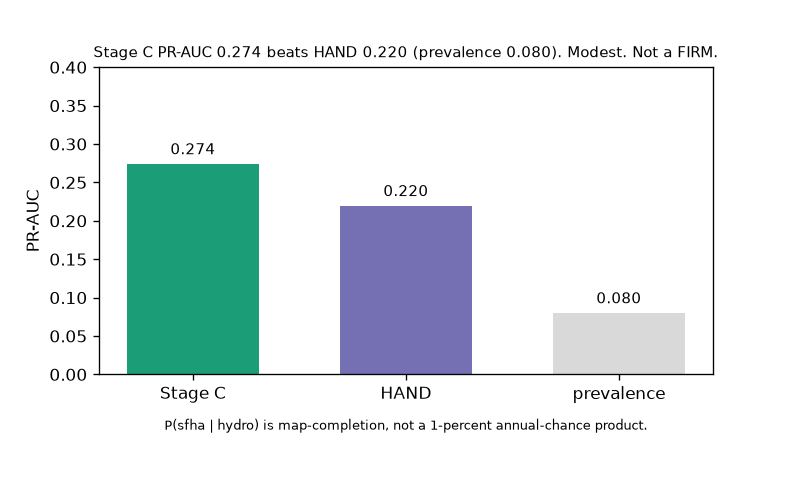
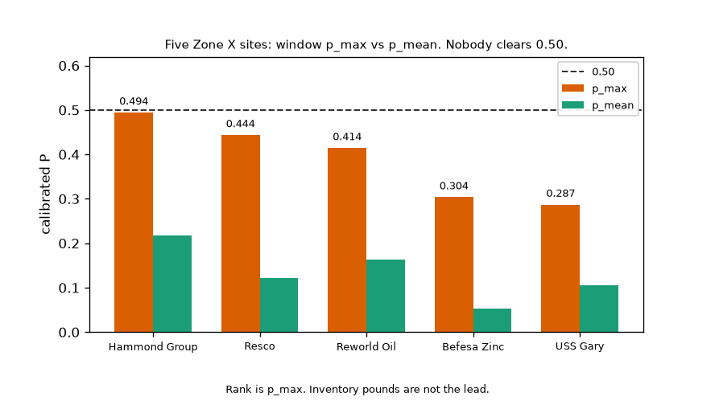

# Calumet flood-map completion

Which 30 m cells in Little Calumet-Galien (HUC-8 04040001) look like the current FEMA SFHA given terrain and distance-to-water?

Locked Stage D (`dc1689e`). Modest map-completion on a lake-plain HUC. C beats HAND (PR-AUC 0.274 vs 0.220, prevalence 0.080). Five Zone X sites have a higher neighbor cell than the lot mean; none clear 0.50 on the max. Denominator: 70 of 73 TRI points are unshaded X. HARSCO MINERALS - NBC is mapped moderate hazard (shaded X). SHERWIN-WILLIAMS CO is a zone hole with no window score. FORD MOTOR CO CHICAGO ASSEMBLY is a zone hole with a scored window (p_max 0.123) and still not D1. Rank is by p_max, so USS Gary (12.9M lb, mean 0.105) is not the headline. Calibrated P only. Indy plant names stay off this repo.

Stage 0 pins HUC 04040001 and a 30 m EPSG:5070 template. Live WBD area is 1903.21 km² (states IL,IN,MI). Stage A is NLCD 2021 plus NFHL layer 28. Stage B is D8 HAND on this template. `P(sfha | hydro)` is map-completion, not a 1-percent annual-chance product. Upper White `05120201` stays in its own tree. OFR 2008-1322 does not cover this HUC.



Figure 1. Map-completion skill: Stage C PR-AUC 0.274 vs HAND 0.220 vs prevalence 0.080. Modest. Not a FIRM.



Figure 2. Edge screen on calibrated P. Five Zone X sites ranked by p_max. All p_max stay below 0.50. Rank is p_max, not inventory pounds.

 [Upper White floodplain completion](https://github.com/martialsystems/indiana_flood_completion)

## Stage 0

Fixture HUC polygon plus a 32x32 30 m template. Live WBD fetch writes `data/raw/huc04040001.geojson`.

## Stage A

Live NLCD 2021 template (refuses the 32x32 fixture). NFHL `S_FLD_HAZ_AR` on layer 28. Gate samples: Gary downtown (unshaded X), Gary Little Calumet at Grant Street (SFHA), Crown Point till-plain (unshaded X).

## Stage B

3DEP on the Stage A template. NHD flowlines keep ftype 460 and 558. Slope floor, burn, fill, D8, TWI, HAND along flow, distance to flowline and waterbody. Fixture template refused. Nora HAND is not an input.

## Stage C

New train on the Stage B bands. Beats HAND, modest PR-AUC (0.274 vs HAND 0.220, prevalence 0.080). Nested HUC-10 isotonic moved rank too far; the shipped map is pooled OOF isotonic. HAND nodata stays nodata.

## Stage D

Edge screen on calibrated P, no 0.75 cutoff. Highest window-max is 0.49. Site-means are 0.05 to 0.22. Nobody has a wet footprint on this score. Five Zone X rows, ranked by p_max, each with p_mean. Do not publish expected pounds as a lead number. Pages is not restamped with these names. FIM-or-stop waits.

```bash
python3.12 -m venv .venv
source .venv/bin/activate
pip install -r requirements.txt
PYTHONPATH=src:. python3 scripts/run_stage0.py --huc tests/fixtures/huc.geojson --out logs/stage0_fixture
.venv/bin/python -m pytest tests -q
PYTHONPATH=src:. python3 scripts/fetch_wbd.py data/raw
PYTHONPATH=src:. python3 scripts/run_stage_a.py --huc data/raw/huc04040001.geojson --out logs/stage_a
PYTHONPATH=src:. python3 scripts/run_stage_b.py --huc data/raw/huc04040001.geojson --out logs/stage_b
PYTHONPATH=src:. python3 scripts/run_stage_c.py --huc data/raw/huc04040001.geojson --out logs/stage_c
PYTHONPATH=src:. python3 scripts/run_stage_d.py --huc data/raw/huc04040001.geojson --out logs/stage_d
```

Do not use stock `/usr/bin/python3 -m pytest`. Empty WBD features stop (`fetch_wbd.py` exit 2). Stage A and B stop if the template looks like the fixture grid.

| File | Role |
|------|------|
| [METHODOLOGY.md](METHODOLOGY.md) | Locked contract |
| [AGENTS.md](AGENTS.md) | Agent rules |
| [CHECKLIST.md](CHECKLIST.md) | Operator list |
| `src/calumetmap/` | HUC, NLCD, NFHL, D8 HAND, HUC-10 CV, isotonic P, TRI overlay |
| `calumetforge/` | GraphForge pin |

Research index: https://gist.github.com/martialsystems/66b896b0a4a0b8cba2b478aef64312f3

MIT. Martial Systems LLC.
